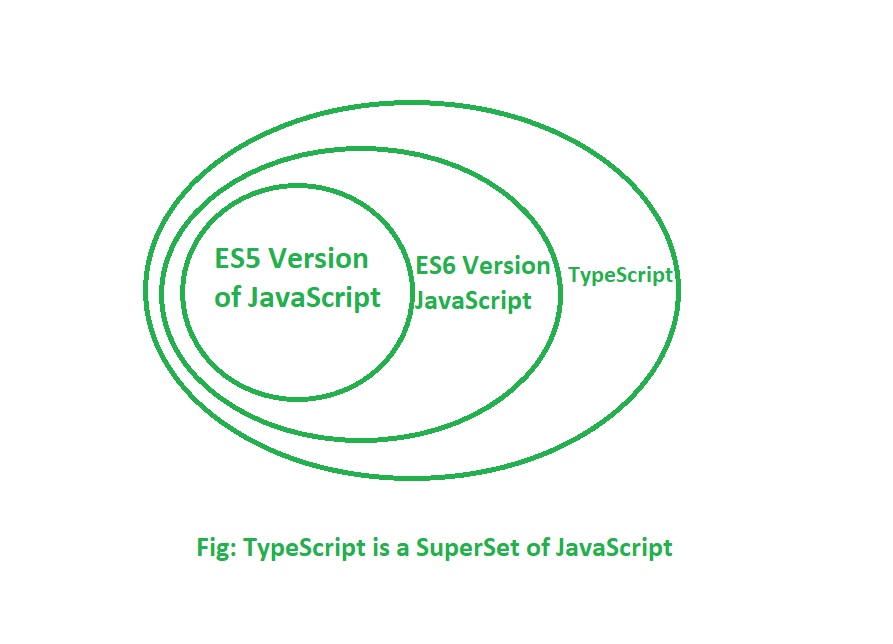

## TS
TypeScript is a statically typed, free, and open-source programming language developed by Microsoft. 
TypeScript enhances the development experience by enabling developers to catch errors early through type checking, and it facilitates the development of large-scale applications with improved code quality and maintainability.
It is a superset of JavaScript, meaning that any valid JavaScript code is also valid TypeScript code. TypeScript adds optional static typing and other features to improve the development experience, making it a popular choice for large-scale JavaScript applications.

# Loosely typed lang : e.g Python , JS , php
# Srtrongly typed lang : eg Java , c++ , Rust , TS

# set up
- npm install -g typescript 
- mkdir node-app
- cd node-app
- npm init -y 
- tsc --init 

- tsc -b : to comiple tsc to js 
- node disc/a -- to run a.js

# type inference in ts 
type inference is a feature that automatically deduces or "infers" the types of variables, function return values, and expressions based on the values they are assigned, so you don’t have to explicitly declare the type. 

eg :
function sum (a : number , b : number ) : `number` {
    return a+b
}
- no need to write : number  

# callbacks 
// expects no Arguments and returns void
function runafter2s (f1 : ()=> void) {
    setTimeout(f1, 2000);
}

# Tsconfig File 
- "target": "es2016" --> specifies EcmaScript version 
eg es5 doesnt support arrow functions => code converts arroy fn in ts to normal fn in js.

- "outDir": "/dist" and "rootdir": "/src"
puts a.js to dist folder and reads a.ts from src folder. 
put dist in .gitignore

- "noImplicitany" : false => 
dont need to specify data types

- "removeComments" : true => 
comments dont pass to a.js

- 

# zod does runtime checks while TS does compile time checks

d in that interface. This is useful for ensuring consistency and providing strong typing, especially in complex applications.

# curly braces in React 
- Without Curly Braces: When you pass a prop without curly braces, React treats it as a string. 
For example:
<Component prop="123" />

- With Curly Braces: Using curly braces lets you pass a variable, a JavaScript expression, or any non-string data type (like numbers, arrays, objects, functions) directly to the prop. 
For example:
<Component prop={123} />      // Passes a number
<Component prop={myVariable} /> // Passes the value of `myVariable`
<Component prop={2 + 3} />      // Passes the result of an expression, `5`
<Component prop={{ name: 'Alice' }} /> // Passes an object

- In JavaScript and TypeScript, when defining objects inline, use : for key-value pairs inside the curly braces { }.

# interfaces 
[text](Interferences.md)

# types 
[text](types.md)

# readonly
